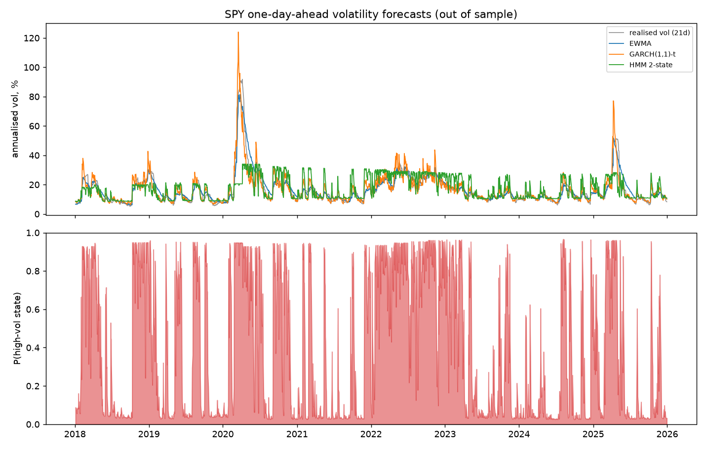
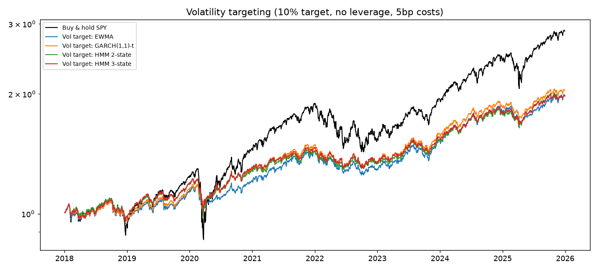
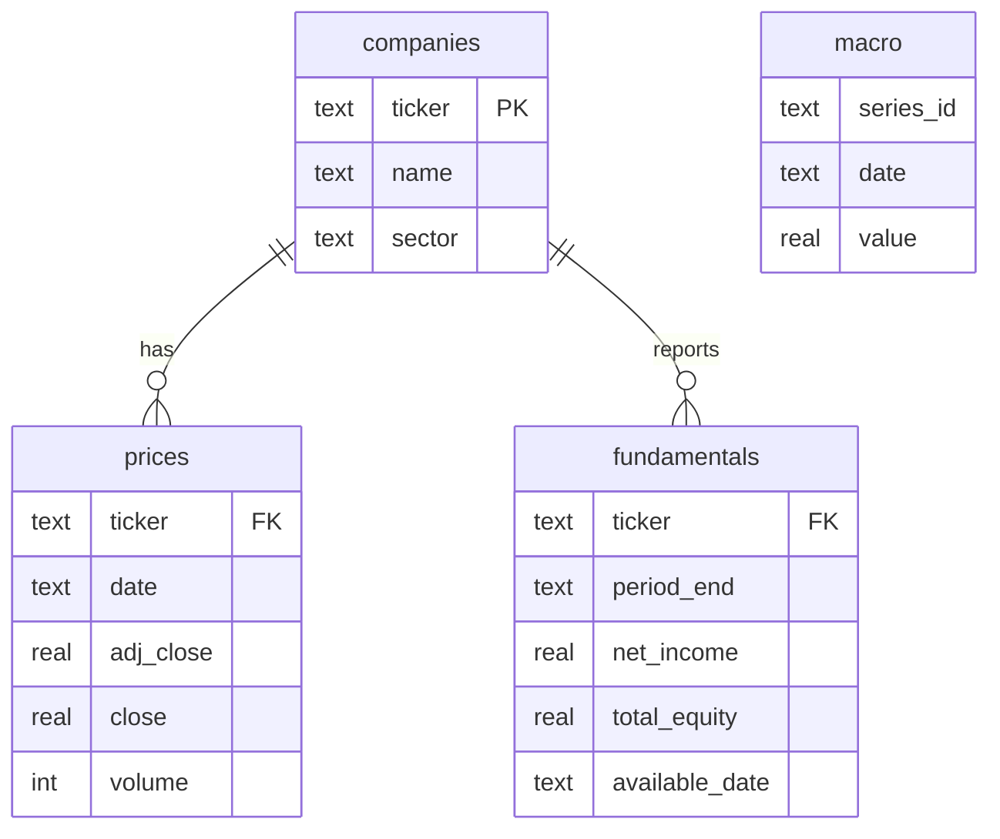

# Equity risk and volatility analytics pipeline

An end-to-end finance data project in Python, SQL and Excel. It loads daily market data for 48 US large caps
plus SPY into a SQL database, analyses risk with SQL, builds a formula-driven Excel risk dashboard, then tests
whether regime-aware models forecast volatility better than standard ones and whether better forecasts help a
volatility-targeting strategy.

**Question:** how do risk and return behave across market regimes, and does a regime-aware model forecast
volatility better than a plain GARCH model?

**Short answer:** risk changes a lot across regimes, but the regime-aware models (hidden Markov models) did not
beat GARCH(1,1) out of sample. Volatility targeting cut maximum drawdown by about two thirds without a
measurable change in Sharpe ratio.

## Results

Data: Yahoo Finance prices and FRED macro series, 2015-2025. Forecasts are walk-forward and out of sample,
2018-01-04 to 2025-12-30 (2,008 days). Full tables and caveats are in [`outputs/findings.md`](outputs/findings.md).

### Risk depends on the regime

Using the previous day's VIX close as the regime signal, average sector volatility was **14.4%** when VIX was below 15
and **40.6%** when it was 25 or above, roughly 2.8 times higher (query `q6`).

### Volatility forecasting (SPY, one day ahead)



| Model | QLIKE (lower is better) | Mincer-Zarnowitz R² | Diebold-Mariano p-value vs GARCH |
|---|---|---|---|
| **GARCH(1,1)-t** | **0.945** | **0.27** | n/a |
| VIX bucket | 1.030 | 0.03 | 0.13 |
| EWMA | 1.031 | 0.16 | 0.001 |
| Rolling 21-day | 1.079 | 0.14 | < 0.001 |
| HMM 3-state | 1.087 | 0.02 | 0.16 |
| HMM 2-state | 1.160 | 0.02 | 0.11 |

- GARCH had the lowest QLIKE and the highest R². EWMA and the rolling window were significantly worse than GARCH.
- The HMMs and the VIX bucket model were worse than GARCH on average, but the differences are not statistically significant at the 5% level.
- The HMMs lost most on high-VIX days. When the prior-day VIX was 25 or above, QLIKE was 2.37 for GARCH and 3.20 to 3.48 for the HMMs. These days dominate the total loss because QLIKE punishes under-forecasting heavily.
- On mid-VIX days (15 to 25) the VIX bucket model and the 3-state HMM were slightly better than GARCH (0.963 vs 0.980). That difference was not tested.

Possible reasons for the HMM result, none of them tested yet: each state has a constant variance, so the model can't capture
volatility clustering inside a regime the way GARCH does; quarterly refits react slowly to sudden shocks; and Gaussian
emissions treat a single fat-tailed return as evidence of a regime change, which makes the state probabilities
flicker (visible in the bottom panel of the figure).

### Volatility-targeting backtest

Target volatility 10%, SPY weight capped at 100% (no leverage), remainder in cash, 5bp cost per unit of turnover.
The weight for each day is set from the previous day's forecast.



| Strategy | CAGR | Ann. vol | Sharpe | Max drawdown | Turnover / yr |
|---|---|---|---|---|---|
| Buy and hold SPY | 14.2% | 19.5% | 0.65 | -33.7% | 0.0 |
| Vol target, GARCH | 9.4% | 10.0% | 0.69 | -12.2% | 11.6 |
| Vol target, EWMA | 8.9% | 10.2% | 0.64 | -12.8% | 4.4 |
| Vol target, HMM 2-state | 9.0% | 10.8% | 0.61 | -19.5% | 13.5 |
| Vol target, HMM 3-state | 8.9% | 10.8% | 0.61 | -17.6% | 12.9 |

Volatility targeting worked as a risk tool: realised volatility landed close to the 10% target and drawdowns shrank a lot.
The Sharpe differences (0.61 to 0.69 against 0.65) are within noise for an 8 year sample, and CAGR fell because
average SPY exposure was about 70%. The GARCH forecast gave the best drawdown control.

## What the pipeline does

| Step | File | What it does |
|---|---|---|
| Data | `src/fetch_data.py` | Prices (yfinance), VIX / 10-year yield / Fed funds (FRED), annual fundamentals |
| Demo data | `src/generate_sample_data.py` | Synthetic market with built-in regimes, so the pipeline runs offline |
| Database | `sql/schema.sql`, `src/load_db.py` | SQLite schema with keys and indexes |
| SQL analysis | `sql/views.sql`, `sql/queries/q1..q8` | Window functions, CTEs, joins, `NTILE`, `RANK`. Output in `outputs/sql/` |
| Models | `src/models.py` | Walk-forward forecasts: rolling, EWMA, GARCH-t, VIX bucket, 2 and 3 state HMM |
| Backtest | `src/backtest.py` | Volatility targeting on SPY with trading costs |
| Excel | `src/build_excel.py` | Dashboard: VaR, CVaR, drawdown, beta, correlation matrix, stress tests, charts |
| Report | `src/report.py` | Writes `outputs/findings.md` from the results |



### Excel dashboard

`outputs/risk_dashboard.xlsx` holds a 10-stock portfolio (last 504 trading days). Every number on the Risk and Summary tabs is a
live formula, so changing the weights on the Inputs tab updates 1-day historical and parametric VaR, CVaR, drawdown,
beta, the correlation matrix and the stress scenarios. I checked the headline figures against an independent pandas calculation.

### SQL queries

| Query | What it shows |
|---|---|
| `q1_data_quality` | Row counts, date ranges, bad prices, extreme moves per ticker |
| `q2_sector_performance` | Equal-weight sector portfolios, `RANK()` |
| `q3_market_vol_monthly` | 30-day rolling volatility view, month-end sampling, join to VIX |
| `q4_max_drawdown` | Running max with a window frame, `ROW_NUMBER()` |
| `q5_beta_vs_spy` | Beta from covariance and variance written in plain SQL |
| `q6_regime_performance` | Sector return and volatility by prior-day VIX bucket |
| `q7_fundamentals_vs_returns` | Point-in-time join (report date + 90 days), `NTILE(4)` |
| `q8_worst_market_days` | Worst SPY days with the VIX close |

## Run it

```bash
pip install -r requirements.txt

python run_pipeline.py --source real        # Yahoo Finance + FRED, needs internet
python run_pipeline.py --source synthetic   # offline demo data, about 80 seconds
pytest tests                                # run after a pipeline run
```

The synthetic mode has regimes built into the data, so its results only show that the code runs. Outputs are labelled when
they come from synthetic data. The results above are from a real-data run.

## Avoiding common backtesting mistakes

- **Regimes use no future data:** the VIX regime is based on the previous day's close.
- **The HMM filter is causal:** hmmlearn's `predict_proba` is smoothed, which uses future observations. `models.filter_probs` is a forward-only filter, and a test checks that truncating the series leaves earlier rows unchanged.
- **Walk-forward evaluation:** models are refit on an expanding window every 63 days, and the forecast for day t+1 only uses data up to day t.
- **Point-in-time fundamentals:** a fiscal year's numbers are treated as known 90 days after year end.
- **A suitable loss function:** squared returns are a very noisy variance proxy, so models are compared with QLIKE and Diebold-Mariano tests rather than raw squared error alone.
- **Trading costs** are included in the backtest.

## Limitations

- **Survivorship bias:** the universe is today's large caps. Sector returns (Technology at about 36% a year) are flattered by including recent winners.
- **Small high-VIX sample:** days with the prior-day VIX at 25 or above are clustered in a few episodes, 2020 most of all, so the stress-regime comparison is thin evidence.
- **Fundamentals are thin:** yfinance only returns a few years of statements, giving about 25 observations per ROE quartile in `q7`. That query demonstrates the point-in-time join and is not evidence about factor returns. ROE is also distorted by companies with very small equity (the top quartile averages over 200%).
- **Backtest simplifications:** flat 5bp cost, no weight drift, financing or taxes, and no leverage.
- **Modest evidence on Sharpe:** the Sharpe differences between strategies are not statistically distinguishable.
- **Database:** the SQL is written for SQLite. Most of it should port to PostgreSQL but that has not been tested.

## Next steps

1. Student-t emissions or VIX as a second observed feature in the HMM, to address the flickering state probabilities.
2. A combined forecast (for example GARCH plus the VIX bucket) and a check of whether excluding 2020 changes the stress-day result.
3. SEC EDGAR fundamentals for a real history, and more factors (leverage, margins).
4. Use Excel's Solver on the Inputs tab to maximise the Sharpe ratio, then compare out of sample.
5. Move the database to PostgreSQL in Docker.

## Layout

```
run_pipeline.py     config.py     requirements.txt
sql/                schema.sql, views.sql, queries/
src/                data, loading, SQL runner, models, backtest, Excel, report
tests/              SQL vs pandas checks, HMM causality, loss-function tests
outputs/            risk_dashboard.xlsx, findings.md, figures/, sql/*.csv
```
