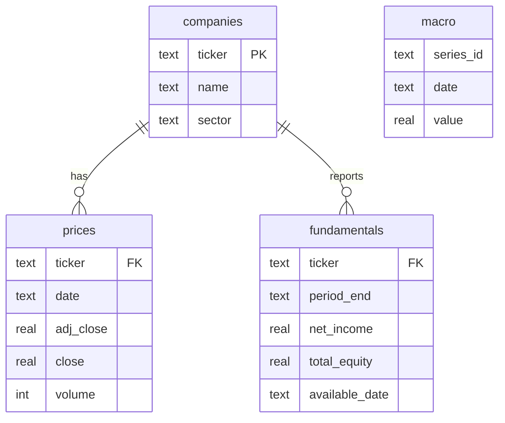

# Equity risk and volatility analytics pipeline

An end-to-end finance data project: load market data into a SQL database, analyse risk with SQL,
build an Excel risk dashboard, then test whether regime-aware models forecast volatility better than
standard ones and whether that helps a volatility-targeting strategy.

**Question:** how do risk and return behave across market regimes, and does a regime-aware model
forecast volatility better than a plain GARCH model?

## Run it

```bash
pip install -r requirements.txt

python run_pipeline.py --source synthetic   # offline demo data, runs in about 80 seconds
python run_pipeline.py --source real        # Yahoo Finance + FRED, needs internet
pytest tests                                # after a pipeline run
```

Start with `synthetic` to see it work, then switch to `real`. **The synthetic data has regimes
built in, so its results only prove the code runs.** Every output is labelled when it comes from
synthetic data. Only report results from a `real` run.

The `real` mode hasn't been run against the live Yahoo/FRED endpoints during development (no network
access there), only against mocked responses in the same format. If a download fails, the error will
be in `src/fetch_data.py`, and each fetch function is small and independent.

## What's in it

| Step | File | What it does |
|---|---|---|
| Data | `src/fetch_data.py` / `src/generate_sample_data.py` | 48 large caps + SPY prices (2015-2025), VIX / 10y yield / Fed funds from FRED, annual fundamentals |
| Database | `sql/schema.sql`, `src/load_db.py` | SQLite schema with keys and indexes, loaded via Python |
| SQL analysis | `sql/views.sql`, `sql/queries/q1..q8` | Window functions, CTEs, joins, NTILE, RANK. Results land in `outputs/sql/` |
| Models | `src/models.py` | Walk-forward 1-day variance forecasts: rolling, EWMA, GARCH-t, VIX bucket, 2 and 3 state HMM |
| Backtest | `src/backtest.py` | Volatility targeting on SPY with costs, vs buy and hold |
| Excel | `src/build_excel.py` | Live-formula risk dashboard: VaR, CVaR, drawdown, beta, correlation matrix, stress tests, charts |
| Report | `src/report.py` | `outputs/findings.md` with tables. You write the interpretation |



## SQL queries

| Query | Skill shown |
|---|---|
| `q1_data_quality` | Aggregation, correlated subquery, sanity checks |
| `q2_sector_performance` | CTEs, equal-weight sector portfolios, `RANK()` |
| `q3_market_vol_monthly` | Rolling window view, month-end sampling, join to VIX |
| `q4_max_drawdown` | Running max with a window frame, `ROW_NUMBER()` |
| `q5_beta_vs_spy` | Beta from covariance / variance written in plain SQL |
| `q6_regime_performance` | Sector behaviour by prior-day VIX bucket |
| `q7_fundamentals_vs_returns` | Point-in-time join (report date + 90 days), `NTILE(4)` |
| `q8_worst_market_days` | Ordering, limits, left join to macro data |

The SQL uses SQLite. Window functions, CTEs and `NTILE` are standard so most of it ports to
PostgreSQL directly, but I haven't run it there. The main change would be swapping the
`sqrt(E[x²] - E[x]²)` volatility for `STDDEV_SAMP`.

## Avoiding the usual mistakes

- **No lookahead in regimes:** the VIX regime uses the previous day's close.
- **No lookahead in HMMs:** hmmlearn's `predict_proba` is smoothed (uses future data). The forward filter in `models.filter_probs` is causal, and a test checks that truncating the series doesn't change earlier rows.
- **Walk-forward:** models are refit on an expanding window every 63 days, and forecasts for day t+1 only use data to day t.
- **Point-in-time fundamentals:** ROE is only "known" 90 days after fiscal year end.
- **Right loss function:** QLIKE plus Diebold-Mariano tests, because squared returns are a very noisy variance proxy.
- **Costs:** the backtest charges 5bp of turnover.

## Known limitations (good things to discuss or fix)

- Universe is today's large caps: survivorship bias.
- The 2-state HMM's probabilities flicker on single large returns, because Gaussian emissions treat a fat-tailed shock as evidence of a regime change (visible in `outputs/figures/vol_forecasts.png`). Options: Student-t emissions, add VIX as a second observed feature, or a sticky transition prior.
- yfinance fundamentals only go back a few years. SEC EDGAR's Financial Statement Data Sets would give a real history.
- Backtest ignores weight drift, financing and taxes, and caps SPY weight at 100%.
- Volatility targeting reduces risk reliably; whether it improves Sharpe depends on the sample. Report what you find.

## Extension ideas

1. Add VIX as a second feature in the HMM, or fit a Markov-switching GARCH.
2. Replace fundamentals with EDGAR data and test more factors (leverage, margins).
3. Use Excel's Solver on the Inputs tab to maximise the Sharpe ratio, then compare out of sample.
4. Move the database to PostgreSQL in Docker and port the queries.
5. Add a Streamlit front end over the SQL results.

## Layout

```
run_pipeline.py     config.py     requirements.txt
sql/                schema.sql, views.sql, queries/
src/                data, loading, SQL runner, models, backtest, Excel, report
tests/              SQL vs pandas checks, HMM causality, loss-function tests
outputs/            risk_dashboard.xlsx, findings.md, figures/, sql/*.csv
```
